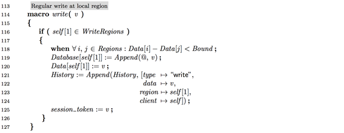
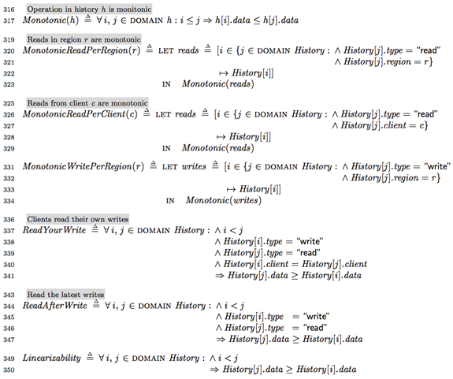

# TLA+ for the general model with multiple clients across different Azure regions

We present the TLA+/PlusCal specifications of our general model, where multiple clients across different regions put Cosmos DB to the test with respect to the consistency guarantees it provides in the presence of concurrent reads and writes. 

In this general model, as with the actual Cosmos DB service, the database is modeled to be associated with a set of Azure regions. The clients perform their writes and reads to their respective local regions. The writes are appended to the _Database[r]_ of the corresponding (destination) region _r_. The Cosmos DB protocol calls the replicate macro to perform anti-entropy across the regions. The macro selects two regions and merges their _Database_ in a fashion that respects the _happened-before_ relationship.

In this case, the happened-before relationship is defined via the use of "<" on the _value_ that serves as a shared backchannel among the clients in order to drive and check the database for linearizability and other guarantees provided. An easy realization of _value_ is to use the wall-clock as the shared backchannel among the clients. 

The read operations (alongside with write operations) are recorded in _History_ variable in order to capture a trace of global client operation history. The _History_ trace is then used for checking for the five consistency levels, which are depicted at the end of the specification file.

When we run the model checker, for example with the _Consistency_ parameter set to bounded staleness, we can verify that the database provides monotonic read, read your write, as well as the _K_-staleness guarantee with respect to the latest write in any of the regions. 

