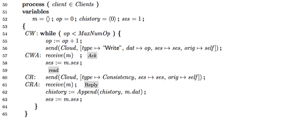
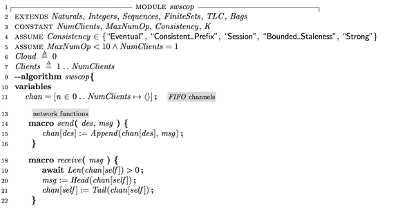
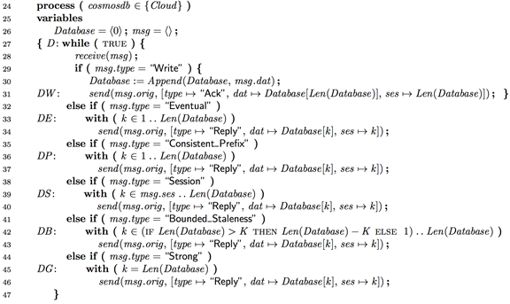

# TLA+ for the client writing incremented counter values

In this scenario, the client writes to the database the value of its local counter (incremented after each write operation), and reads from the database with one of the 5 consistency levels provided, demonstrating how the consistency levels compare and contrast with each other. The client code is simple.

The client performs op number of iterations, writing to and reading from the database. (This number is bounded by `MaxNumOp` to keep the state space finite and allow for feasible model checking.)

Inside the loop, on line 56, the client sends a write request to the item in the database with an incremented `op` value, and waits for the reply on line 57. The `ses` variable is to keep a session state with the database, which is only utilized for checking the session consistency.

On line 60, the client proceeds to read from the database after its own write. The read request can be sent with one of five consistency levels supported by Cosmos DB: strong, bounded staleness, session, consistent prefix, and eventual. The client waits for the read reply on line 61, and, on line 62, the read reply is recorded in the `chistory` for proving/checking properties using the model checker.

For completeness sake, we show the code for the send and receive macros. Each process has an inbox channel modeled as a FIFO queue, and processes communicate by appending to each other's FIFO channel queue. The receive operation removes the head of the channel and copies it to the `msg` variable. On line 3, we define the model parameters. The parameter `K` is used for configuring the bound on the bounded staleness.

We model the globally distributed Cosmos database as a single process, however, even through this single process abstraction, we provide a precise definition of the consistency guarantees provided to the client.

The `cosmosdb` process is always available to respond to the client requests. It receives the message at the head of its message queue, and based on the type of the request and its state history maintained at the `Database` variable, it responds back to the requester.

If the message is a "Write" message, the value in the message is appended to the `Database` variable on line 30. To keep things simple, in this first scenario, we model a single item with a single value. An "Ack" response is sent to the requester on line 31.

In this scenario, since the client increments and writes its counter to the database, the counter values stored in the database are consecutive. The reads by the client nicely demonstrates how the 5 consistency levels differ from each other on this simple example.

If the message is a "Read" message with "Eventual" consistency level, the database abstraction returns a value from the `Database` history. This emulates the client reading at a region or at a replica where the most recently written value has not been replicated to. (Note that returning any value from `Database` history is a worse case we consider for pedagogic reasons. A higher fidelity model would use a "fence" parameter to bound the time it takes for the writes to propagate at all replicas and return the read to be fresher than the "fence" perimeter.)

The response for the consistent prefix based read is the same as that with eventual, because Cosmos DB only returns one value to the read rather than a history of values. As far as the internal workings is concerned, Cosmos DB satisfies prefix consistency by ensuring that there are no gaps in the replication commit sequence for any replication region.

The response to the session consistency based read is given such that it is not older than the client's observation/knowledge of the database state from its last interaction. For this reason the `ses` variable is employed. This corresponds to the client's knowledge of the Logical Sequence Number (LSN) of the database replica it last interacted. The database returns the read response taking this into the consideration.

The bounded staleness consistency based read is returned to be within K of the latest written value for the item at the database. In other words, the value is returned to be from _Len(Database)-K ..Len(Database)_. (The IF THEN statement guards for the case where the length of `Database` history is less than `K`.)

Finally, strong consistency based read is return to the most recent value for the item.

For model checking, we use the following invariants:

When we set Consistency="Strong" in the model checker to check for strongly consistent reads, we find all the 5 invariants to be satisfied; since strong read is the most limiting category, it satisfies the other categories. The reason we use _pc[1]=CW_ as the guard is to check for the strong consistency guarantee right after the read operation. If the model checker evaluates the right hand side of the "Strong" invariant after a "Write" operation by this single client to the database, it would be violated since the `Database` has a new value that is not present in `chistory` yet.

When we check for Consistency="Session", we find that all the invariants, including the "Strong" consistency, to be satisfied. This is because session consistency ensures that the client reads a value as recent as its last interaction with the database, and for the single client case, the session and the strong consistency become equal.

When we check for bounded-staleness, we find that all the invariants, except for "Strong", to be satisfied. While "Strong" demands the most recent value, the bounded staleness read is OK with a value that is within `K` versions older than the most recent write. (The "Session" predicate is also satisfied due to a technicality/artifact of the model: the read operation returns the LSN of the write it returns, so session is checked with respect to the last token returned.)

When we check for consistent prefix, we find that strong and bounded-staleness predicates are violated, because consistent prefix reads fail to meet freshness requirements in those predicates. The screenshot from the model checker shows a trace where the most recent value in the _Database_ is 1, whereas that in the _chistory_ is 0. Consistency="Eventual" returns the same results as consistent prefix.

## Sources

- [swscop.pdf](./swscop.pdf)
- [swscop.tla](./swscop.tla)
