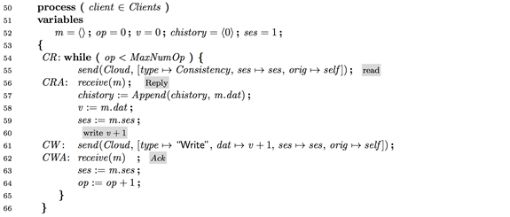

# TLA+ for the client reading, incrementing, writing-back counter values

This is another scenario, similar to scenario 1. Here the client reads the counter value from the database (with one of the five consistency levels configured), increments it, and writes it back. Through this example, we show that only with the session and strong consistency reads (which return the most recent value of the counter), the counter values stored in the database become consecutive.

The database model is unchanged compared to Sceanrio 1. Only the client model is slightly modified as below.

The invariants we check are also unchanged compared to Scenario 1. However, the result of the model checking differs in this case due to the new client logic employed.

We see that, only with the session and strong consistency reads, the counter values stored in the database become consecutive. The other reads may not return fresh enough results to achieve consecutive counter values written to the database.

Here is a sample trace the model checker returns for "Strong" read case (this is also the case for "Session" consistency). With strong reads, the client reads the most recent value from the database, increments and writes it back, making the database and client-read histories consecutive (modeled by `Database` and `chistory` variables).

On the other hand, the trace for the bounded staleness reads show how reading a slightly stale value (_K_=2) can render the `Database` and `chistory` non-consecutive, because bounded staleness reads violate the "Strong" invariant predicate.

For Consistency="Prefix" and "Eventual", the predicates for Strong, Session,and Bounded-Staleness predicates are violated.

## Sources

- [swscrw.pdf](./swscrw.pdf)
- [swscrw.tla](./swscrw.tla)
